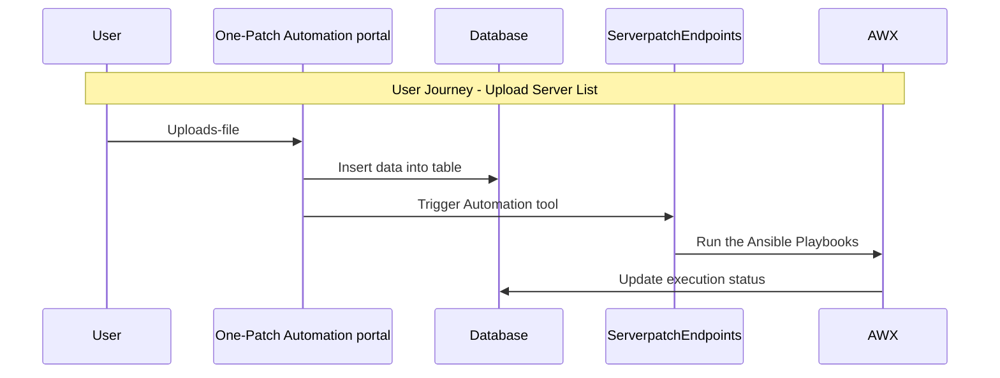

# Server-Patching-Tool
Server-Patching-Tool Framework simplifies Linux servers patch management and tracking of automated patching execution status through interactive dashboard and reporting features.

## Overview 

One-Patch Automation Framework simplifies Linux servers patch management and tracking of automated patching execution status through interactive dashboard and reporting features.

This framework consists of mainly three components:
- Django Web Application for Centralized: **patchautomation_portal**
- FastApi rest services for triggering automation tool: **patchautomationEndpoints**
- AWX for orchestration ansible playbooks execution and status updates: **ansible_scripts**

## Pre requisites

- Python above version 3.x.
- AWX latest version(https://github.com/ansible/awx/tree/devel/tools/docker-compose).
  - Knowledge of configuring AWX is expected.


## Configuration

- **One-patch Automation Portal**: In `variables.py` file set your AWX URL and file paths
- **ServerPatchEndpoints**: In `properties.py `file set AWX `credentials`, `vault_id`, `ssh_key_id`, `database_url`
- **AWX**:
  - Add the ssh key to access the remote servers.
  - Create a project.
  - Add the ansible_script provided into the newly created project.
  - Create an inventory.
  - Add a notification webhook set target url as http:/YOUR_HOST/update_runid as POST method.


## Starting the Development Environment

### Clone the project
```bash
https://github.com/Infosys-CodeStore-Repos/OnepatchServerAutomation.git
```
### Install the requirements.txt
```bash
pip install -r requirements.txt
```
### Start the ServerPatchEndpoints
```bash
python -m uvicorn --workers 5 --host=0.0.0.0 --port=61008 serverPatchingEndpoints:app
```
### Start the One-patch Automation Portal
To create DB and required tables run below commands.
```bash
python manage.py migrate
```
To start the app
```bash
python -m uvicorn --host=0.0.0.0 --port=61007 patchautomation_portal.asgi:application
```

### Usage

- **Bulk Patching of Linux Servers**: Upload a CSV template provided with lists of servers to be patched. Track upload journey and execution status thorugh track upload tab.
- **Report Generation**: In Application Overview tab, Select  the Application name to view details for the servers under the Application and their current execution status and patch version and export complete Master dump using the button available below.

### Workflow of the Application


